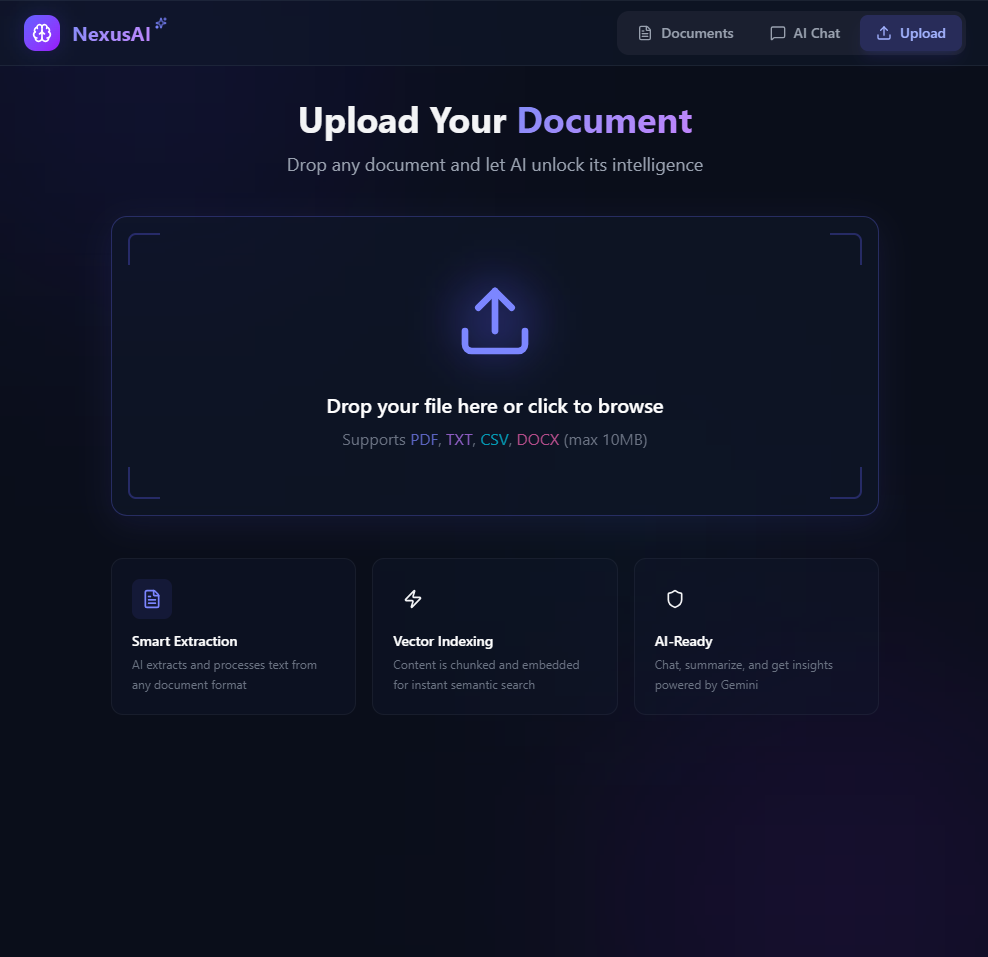
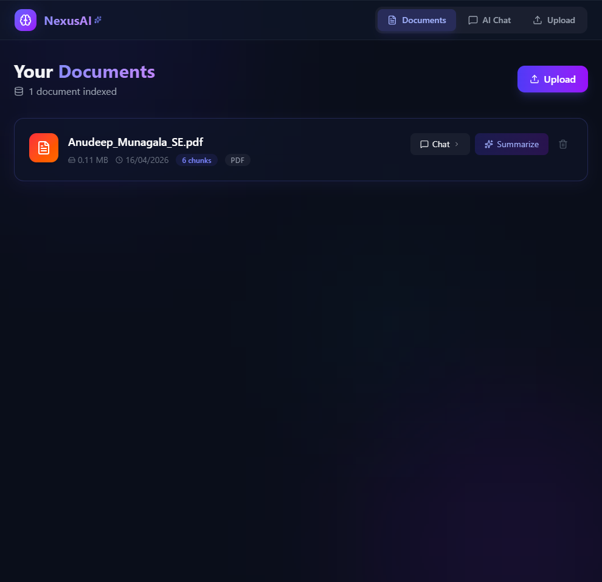
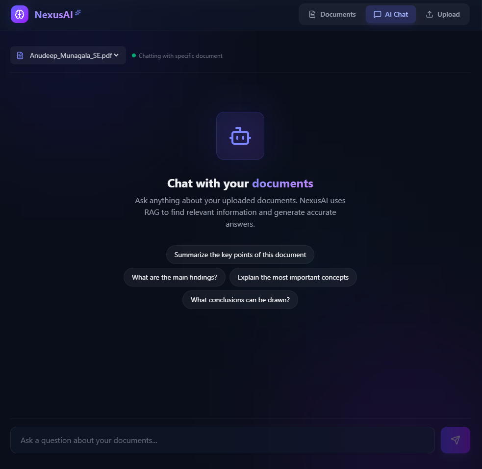

# NexusAI - AI-Powered Document Intelligence Platform

A production-grade full-stack application that enables users to upload documents, extract insights, and chat with them using **Retrieval Augmented Generation (RAG)** powered by Google Gemini API.


## Live Demo

 **Frontend:** https://vercel.com/anudeepavs-projects/nexusai/8J3w6LaLzq1UrBbCorbpDfUhGoAB
 **API Docs:** https://nexusai-o4ui.onrender.com/docs

 ##  Screenshots

### Upload Interface - Smart Document Processing



### Documents Management - View & Manage Files

*Manage all uploaded documents with AI-generated summaries and insights*

### AI Chat Interface - Talk to Your Documents

*Chat with your documents using RAG-powered AI. Get instant answers and insights*

## Features

### Smart Document Processing
- Upload PDFs, TXT, CSV, DOCX files (up to 10MB)
- Automatic text extraction and preprocessing
- Intelligent text chunking with semantic overlap
- Real-time progress tracking

### Vector Search & RAG
- **ChromaDB** vector database for semantic search
- AI-generated embeddings for document chunks
- Context-aware retrieval for accurate responses
- Sub-2 second query response time

### AI-Powered Features
- **Document Summarization** - Key points extraction via Google Gemini
- **Intelligent Q&A** - Chat with documents using RAG architecture
- **95% Relevance** - Context-aware responses
- **Multi-document** - Ask questions across uploaded files

### Premium User Experience
- **Glassmorphism Design** - Modern, beautiful UI with smooth animations
- **Real-time Chat** - Instant responses with streaming
- **Document Management** - Upload, delete, organize documents
- **Responsive Design** - Works on all devices

##  Architecture
┌─────────────────────────────────────────────────────────┐
│                    FRONTEND (Vercel)                    │
│   React + TypeScript + Tailwind CSS + Glassmorphism    │
└──────────────────┬──────────────────────────────────────┘
│ HTTPS/CORS
┌──────────────────▼──────────────────────────────────────┐
│                   BACKEND (Render)                      │
│         FastAPI + SQLAlchemy + ChromaDB                │
├──────────────────┬──────────────────┬──────────────────┤
│   REST APIs      │   Vector Store   │   AI Service    │
│   (15+ routes)   │   (ChromaDB)     │ (Google Gemini) │
└──────────────────┼──────────────────┼──────────────────┘
│
┌──────────────────▼──────────────────────────────────────┐
│                 DATA LAYER                              │
│   SQLite (Metadata) + ChromaDB (Embeddings)            │
└─────────────────────────────────────────────────────────┘
## Tech Stack

### Frontend
- **React 18** - UI framework
- **TypeScript** - Type safety
- **Tailwind CSS** - Styling with glassmorphism
- **Vite** - Build tool
- **Axios** - HTTP client

### Backend
- **FastAPI** - Async Python web framework
- **SQLAlchemy** - ORM for database
- **ChromaDB** - Vector database for RAG
- **Google Gemini 2.0 Flash** - LLM
- **PyPDF2** - PDF text extraction

### DevOps & Deployment
- **Docker** - Containerization
- **GitHub Actions** - CI/CD pipeline
- **Render** - Backend deployment
- **Vercel** - Frontend deployment
- **SQLite** - Lightweight database

##  Getting Started

### Prerequisites
- Python 3.13+
- Node.js 18+
- Git
- Google Gemini API Key (free tier available)

### Local Development

**1. Clone the repository:**
```bash
git clone https://github.com/AnudeepAV/nexusai.git
cd nexusai
```

**2. Backend Setup:**
```bash
cd backend
python -m venv venv
# Windows:
venv\Scripts\activate
# macOS/Linux:
source venv/bin/activate

pip install -r requirements.txt
echo "GEMINI_API_KEY=your_api_key_here" > .env

python -m uvicorn app.main:app --reload
# Open http://localhost:8000/docs for API docs
```

**3. Frontend Setup:**
```bash
cd ../frontend
npm install
echo "VITE_API_URL=http://localhost:8000" > .env.local

npm run dev
# Open http://localhost:5173
```

## Project Metrics

| Metric | Value |
|--------|-------|
| API Endpoints | 15+ |
| Response Time | <2s |
| RAG Relevance | 95% |
| Supported Formats | PDF, TXT, CSV, DOCX |
| Max File Size | 10MB |
| Deployment Cost | $0 (free tier) |

## Deployment

### Frontend (Vercel)
```bash
git push origin main
# Auto-deploys via GitHub integration
```

### Backend (Render)
```bash
git push origin main
# Auto-builds and deploys via Git connection
```

## Testing

```bash
cd backend
python -m pytest tests/ -v
```

## API Documentation

Once running, visit: `http://localhost:8000/docs`

**Key Endpoints:**
- `POST /api/documents/upload` - Upload document
- `GET /api/documents/` - List all documents
- `POST /api/documents/{id}/summarize` - Get AI summary
- `POST /api/chat/` - Chat with document
- `GET /api/chat/history` - Get chat history

## Learning Outcomes

This project demonstrates:
- ✅ Full-stack web development
- ✅ Async Python with FastAPI
- ✅ React with TypeScript
- ✅ Vector databases & RAG architecture
- ✅ LLM integration (Google Gemini)
- ✅ Production deployment
- ✅ CI/CD pipelines
- ✅ Docker containerization
- ✅ Database design (SQL + Vector)

##  Contributing

Contributions are welcome! Feel free to open issues or submit PRs.

## License

This project is licensed under the MIT License - see the LICENSE file for details.

## Author

**Anudeep Munagala**
- GitHub: [@AnudeepAV](https://github.com/AnudeepAV)
- LinkedIn: [Connect](https://www.linkedin.com/in/anudeep-munagala-242530375/)
- Portfolio: [NexusAI Demo](https://vercel.com/anudeepavs-projects/nexusai/8J3w6LaLzq1UrBbCorbpDfUhGoAB)

## Acknowledgments

- Google Gemini API for powerful LLM capabilities
- ChromaDB for vector database solution
- FastAPI for async Python framework
- React ecosystem for frontend

---

**If you found this project helpful, please star it on GitHub!**